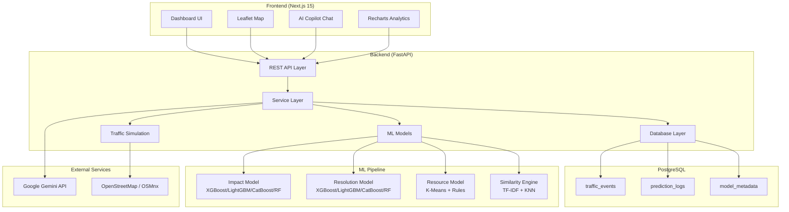

<h1 align="center">🔱 TRINETRA AI</h1>
<h3 align="center">Event-Driven Traffic Intelligence System for Smart Cities</h3>

<p align="center">
  <strong>Gridlock Hackathon 2.0</strong> — AI-powered traffic management platform for Bengaluru
</p>

<p align="center">
  
  
  
  
  
  
  
</p>

---

## 🌐 Live Demo

> **🔗 Live URL**: (https://gridlock-frontend-production.up.railway.app/)
>

---

## 📋 Table of Contents

- [Overview](#-overview)
- [Architecture](#-architecture)
- [Features](#-features)
- [ML Pipeline & Algorithms](#-ml-pipeline--algorithms)
- [Quick Start (Docker)](#-quick-start-docker)
- [Manual Setup](#-manual-setup)
- [API Endpoints](#-api-endpoints)
- [Environment Variables](#-environment-variables)
- [Dataset](#-dataset)
- [Deployment](#-deployment)
- [Project Structure](#-project-structure)
- [Tech Stack](#-tech-stack)
- [License](#-license)

---

## 🔭 Overview

**TRINETRA AI** is a production-ready traffic intelligence system designed for city traffic police operations. It combines **machine learning**, **real-time simulation**, and **AI-powered natural language processing** to help traffic operators:

- **Predict** the impact severity of traffic events (accidents, breakdowns, protests, etc.)
- **Recommend** resource allocation (officers, barricades, tow vehicles)
- **Find** similar historical incidents for data-driven decisions
- **Estimate** resolution times for active incidents
- **Simulate** traffic diversions using real road network data
- **Interact** with an AI Copilot via natural language

Built on **8,173 real traffic events** from Bengaluru with **17 event types**, **10 zones**, **294 junctions**, and **22 corridors**.

---

## 🏗️ Architecture



---

## ✨ Features

### 🎯 1. Impact Scoring Engine
Predicts event severity on a **0-100 scale** using an ensemble of ML models. The composite score considers event cause severity, road closure status, priority, resolution time percentile, corridor importance, peak hour timing, and vehicle involvement.

### 🚔 2. Resource Recommendation Engine
Recommends **officers, barricades, and tow vehicles** using K-Means clustering of historical incidents combined with domain-specific rules. Clusters similar incidents by characteristics and derives resource profiles per cluster.

### 🔍 3. Similar Event Retrieval (Memory Explorer)
Finds **historically similar incidents** using multi-modal embeddings (TF-IDF text features + OneHot categorical + scaled geospatial + binary features) with cosine similarity via NearestNeighbors. Provides average resolution times, historical success patterns, and recommended actions.

### ⏱️ 4. Resolution Time Prediction
Predicts **how long an event will take to resolve** (in minutes) using log-transformed regression. Uses `closed_datetime - start_datetime` as ground truth with a 7-day cap.

### 🗺️ 5. Traffic Diversion Simulation
Computes **alternative routes** when roads are blocked:
- Downloads real road graphs from **OpenStreetMap** via OSMnx
- Identifies affected edges within an impact radius
- Removes blocked segments and computes shortest alternative paths using **NetworkX**
- Calculates **congestion risk score** (0-100) using edge betweenness centrality
- Identifies affected junctions and estimates extra travel time
- Includes **disk caching** for instantaneous subsequent lookups

### 🤖 6. AI Traffic Copilot
Natural language interface powered by **Google Gemini 2.5 Flash**:
- Report incidents in plain English
- Auto-extracts structured event data (type, cause, location, priority)
- Provides tactical responses with action recommendations
- Creates map markers from natural language descriptions

### 📊 7. Feedback & Continual Learning
- Logs every prediction for audit and analysis
- Accepts operator feedback on prediction accuracy
- Computes drift scores between predicted and actual outcomes
- Tracks model performance metrics over time

---

## 🧠 ML Pipeline & Algorithms

### End-to-End Training Pipeline

```
CSV Dataset (8,173 events)
    │
    ├── Step 1: Data Quality Inspection
    │     • Missing values, duplicates, outliers
    │     • Auto-cleaning & normalization
    │
    ├── Step 2: Feature Engineering
    │     • Categorical encoding (OneHot)
    │     • Temporal features (hour, day, peak_hour)
    │     • Binary features (road_closure, has_vehicle)
    │     • Priority encoding
    │
    ├── Step 3: Impact Model Training
    │     • Derive composite impact score (0-100)
    │     • Train: XGBoost, LightGBM, CatBoost, Random Forest
    │     • Tune: GridSearchCV (3-fold CV)
    │     • Select: Best R² score
    │
    ├── Step 4: Resolution Model Training
    │     • Target: log1p(resolution_minutes)
    │     • Train: XGBoost, LightGBM, CatBoost, Random Forest
    │     • Tune: GridSearchCV (3-fold CV)
    │     • Select: Best R² score
    │
    ├── Step 5: Resource Clustering
    │     • K-Means clustering (k=4..9)
    │     • Optimize: Best silhouette score
    │     • Build cluster profiles with resource rules
    │
    └── Step 6: Similarity Index
          • Build: TF-IDF + OneHot + Geo embeddings
          • Index: NearestNeighbors (cosine, brute-force)
```

### Model Comparison Table

| Feature | XGBoost | LightGBM | CatBoost | Random Forest | K-Means | KNN |
|---|:---:|:---:|:---:|:---:|:---:|:---:|
| Impact Score | ✅ | ✅ | ✅ | ✅ | — | — |
| Resolution Time | ✅ | ✅ | ✅ | ✅ | — | — |
| Resources | — | — | — | — | ✅ | — |
| Similar Events | — | — | — | — | — | ✅ |

---

## 🚀 Quick Start (Docker)

### Prerequisites
- [Docker](https://docs.docker.com/get-docker/) & [Docker Compose](https://docs.docker.com/compose/install/)

### 1. Clone the Repository

```bash
git clone https://github.com/iamdeepak2005/Gridlock-Hackathon-2.0.git
cd Gridlock-Hackathon-2.0
```

### 2. Configure Environment

```bash
cp .env.example .env
# Edit .env and set your GEMINI_API_KEY
```

### 3. Start All Services

```bash
docker-compose up --build
```

This will:
- 🐘 Start PostgreSQL 16 database
- 🐍 Build & start FastAPI backend (port 8000)
- ⚛️ Build & start Next.js frontend (port 3000)
- 🗄️ Auto-initialize database tables

### 4. Train ML Models (First Time)

```bash
docker-compose exec backend python -m app.training.train_all /app/data/events.csv
```

### 5. Seed Database (Optional)

```bash
docker-compose exec backend python -m app.database.seed /app/data/events.csv
```

### 6. Access the Application

| Service | URL |
|---|---|
| **Frontend Dashboard** | [http://localhost:3000](http://localhost:3000) |
| **Backend API** | [http://localhost:8000](http://localhost:8000) |
| **Swagger Docs** | [http://localhost:8000/docs](http://localhost:8000/docs) |
| **ReDoc** | [http://localhost:8000/redoc](http://localhost:8000/redoc) |

### Development Mode (with Hot Reload)

```bash
docker-compose -f docker-compose.yml -f docker-compose.dev.yml up --build
```

---

## 🔧 Manual Setup

### Backend

```bash
cd backend
pip install -r requirements.txt
cp .env.example .env
# Edit .env (set DATABASE_URL, GEMINI_API_KEY)

# Train ML models
python -m app.training.train_all data/events.csv

# Seed database (optional)
python -m app.database.seed data/events.csv

# Start server
uvicorn app.main:app --reload --port 8000
```

### Frontend

```bash
cd frontend
npm install
cp .env.example .env.local
# Edit .env.local (set NEXT_PUBLIC_API_URL)

# Start development server
npm run dev
```

Open [http://localhost:9002](http://localhost:9002)

---

## 📡 API Endpoints

All endpoints are available under `/api/v1/` prefix.

| Endpoint | Method | Description |
|---|---|---|
| `/predict-impact` | POST | Predict event impact score (0-100) |
| `/recommend-resources` | POST | Recommend officers, barricades, tow vehicles |
| `/similar-events` | POST | Find similar historical events |
| `/predict-resolution` | POST | Predict resolution time (minutes) |
| `/feedback` | POST | Submit prediction feedback |
| `/model-performance` | GET | Get model metrics & drift scores |
| `/simulate-diversion` | POST | Simulate traffic diversion routes |
| `/events` | GET | Fetch events from database |
| `/copilot` | POST | AI Copilot natural language query |
| `/health` | GET | System health check |

📖 Full interactive documentation at [http://localhost:8000/docs](http://localhost:8000/docs)

---

## 🔐 Environment Variables

### Root `.env` (for docker-compose)

| Variable | Required | Description |
|---|---|---|
| `GEMINI_API_KEY` | Yes* | Google Gemini API key (*for AI Copilot) |
| `NEXT_PUBLIC_API_URL` | No | Backend URL for frontend (default: `http://localhost:8000`) |
| `POSTGRES_DB` | No | Database name (default: `trinetra_db`) |
| `POSTGRES_USER` | No | Database user (default: `trinetra`) |
| `POSTGRES_PASSWORD` | No | Database password (default: `trinetra_pass`) |

### Backend `.env`

| Variable | Required | Description |
|---|---|---|
| `DATABASE_URL` | Yes | Database connection string |
| `GEMINI_API_KEY` | Yes* | Google Gemini API key |
| `MODEL_DIR` | No | Path to trained models (default: `./trained_models`) |
| `DATA_PATH` | No | Path to dataset CSV (default: `./data/events.csv`) |
| `OSMNX_CACHE_DIR` | No | OSMnx cache directory (default: `./osmnx_cache`) |

### Frontend `.env.local`

| Variable | Required | Description |
|---|---|---|
| `NEXT_PUBLIC_API_URL` | Yes | Backend API base URL |
| `GEMINI_API_KEY` | No | Google Gemini key (for Genkit server flows) |

---

## 📊 Dataset

- **8,173** anonymized traffic events from **Bengaluru, India**
- **17 event causes**: accident, vehicle_breakdown, tree_fall, water_logging, congestion, construction, pot_holes, road_conditions, protest, procession, vip_movement, public_event, debris, fog/low_visibility, others, test_demo
- **10 traffic zones** · **294 junctions** · **22 corridors**
- **Date range**: November 2023 — 2024
- **Fields**: geolocation, timestamps, priority, status, vehicle info, road closure, descriptions, resolution times

---

## 🚢 Deployment

### Docker Deployment (Any Cloud)

```bash
# Build production images
docker-compose build

# Push to registry (example with Docker Hub)
docker tag trinetra-backend your-registry/trinetra-backend:latest
docker tag trinetra-frontend your-registry/trinetra-frontend:latest
docker push your-registry/trinetra-backend:latest
docker push your-registry/trinetra-frontend:latest
```

### Using Nginx Reverse Proxy (Single Domain)

An `nginx.conf` is included for serving both frontend and backend under a single domain:

```bash
# Add to docker-compose.yml:
  nginx:
    image: nginx:alpine
    ports:
      - "80:80"
    volumes:
      - ./nginx.conf:/etc/nginx/conf.d/default.conf
    depends_on:
      - frontend
      - backend
```

### Cloud Platforms

| Platform | Backend | Frontend |
|---|---|---|
| **Railway / Render** | Deploy `backend/` as Python service | Deploy `frontend/` as Node service |
| **AWS ECS / GCP Cloud Run** | Use `docker-compose.yml` | Use `docker-compose.yml` |
| **Vercel** | Not supported (Python) | Deploy `frontend/` directly |
| **Firebase App Hosting** | Not supported | Deploy `frontend/` (apphosting.yaml included) |

---

## 📁 Project Structure

```
Gridlock-Hackathon-2.0/
│
├── backend/                          # 🐍 FastAPI Backend + ML
│   ├── app/
│   │   ├── api/                      # Route handlers
│   │   ├── services/                 # Business logic
│   │   ├── ml/                       # ML models & training
│   │   ├── models/                   # ORM + schemas
│   │   ├── repositories/            # Data access
│   │   ├── simulation/              # Traffic diversion (OSMnx)
│   │   ├── training/                # Training pipeline
│   │   ├── database/                # DB connection & seeding
│   │   ├── utils/                   # Helpers
│   │   ├── config.py                # Settings
│   │   └── main.py                  # Entry point
│   ├── tests/                       # Pytest suite
│   ├── trained_models/              # Serialized models (.joblib)
│   ├── data/                        # Dataset CSV
│   ├── Dockerfile
│   ├── requirements.txt
│   ├── .env.example
│   └── README.md
│
├── frontend/                         # ⚛️ Next.js Frontend
│   ├── src/
│   │   ├── app/                     # Pages & layout
│   │   ├── components/              # Dashboard + UI components
│   │   ├── context/                 # React context (state)
│   │   ├── hooks/                   # Custom hooks
│   │   ├── lib/                     # API client & utils
│   │   └── ai/                      # Genkit AI flows
│   ├── Dockerfile
│   ├── package.json
│   ├── next.config.ts
│   ├── tailwind.config.ts
│   ├── .env.example
│   └── README.md
│
├── docker-compose.yml               # 🐳 Production orchestration
├── docker-compose.dev.yml           # 🔧 Dev override (hot reload)
├── nginx.conf                       # 🌐 Reverse proxy (optional)
├── .env.example                     # 📋 Root env template
├── .gitignore
└── README.md                        # 📖 This file
```

---

## 🛠️ Tech Stack

| Layer | Technology |
|---|---|
| **Frontend** | Next.js 15, React 19, TypeScript, TailwindCSS, ShadCN UI |
| **Maps** | Leaflet.js |
| **Charts** | Recharts |
| **Backend** | FastAPI 0.115, Python 3.12, Pydantic v2 |
| **Database** | PostgreSQL 16 / SQLite (dev fallback) |
| **ORM** | SQLAlchemy 2.0 |
| **ML** | scikit-learn, XGBoost, LightGBM, CatBoost |
| **Geospatial** | OSMnx, NetworkX, GeoPandas |
| **AI** | Google Gemini 2.5 Flash, Google Genkit |
| **DevOps** | Docker, Docker Compose, Nginx |

---

## 🧪 Testing

```bash
# Backend tests
cd backend && pytest tests/ -v

# Frontend type check
cd frontend && npm run typecheck

# Frontend lint
cd frontend && npm run lint
```

---

## 📜 License

Hackathon project — **TRINETRA AI** | Gridlock Hackathon 2.0

**Team Repository**: [github.com/iamdeepak2005/Gridlock-Hackathon-2.0](https://github.com/iamdeepak2005/Gridlock-Hackathon-2.0)
